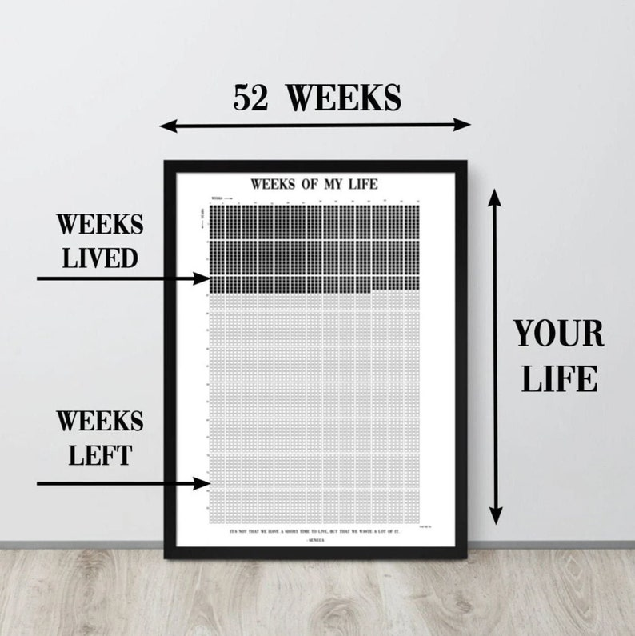

# Life Board

A terminal-based visualization of weeks in an 80-year life. Displays all 4,160 weeks and shades in the weeks already lived.

## Overview

Displays your life as a grid where each row represents 2 years, with 104 boxes per row representing the weeks in those two years.

- **Filled boxes (█)** = weeks already lived
- **Empty boxes (░)** = weeks remaining



## Installation

### Quick Install

Run the setup script to create a symlink:

```bash
./setup.sh
```

This will install the `life` command to `~/.local/bin/` (or `/usr/local/bin/` if sudo is available).

### Manual Install

```bash
ln -s $(pwd)/life.py ~/.local/bin/life
```

Make sure `~/.local/bin` is in your PATH:

```bash
export PATH="$HOME/.local/bin:$PATH"
```

## Usage

```bash
life
```

## Requirements

- Python 3
- Birth date: May 22, 2002 (customize by editing `BIRTH_DATE` in `life.py`)

## Customization

Edit `life.py` to change:
- `BIRTH_DATE`: Your birth date
- `TOTAL_WEEKS`: Total week count (default: 80 years)
- `FILLED_BOX` / `EMPTY_BOX`: Display characters
